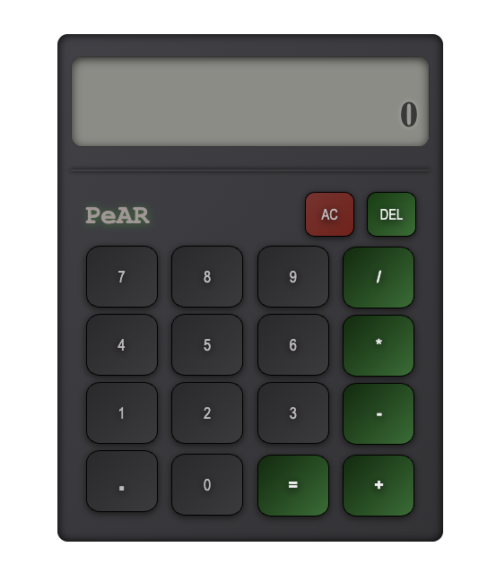

A simple calculator I built using HTML, CSS, and JavaScript for The Odin Project course.

Handles basic operations — add, subtract, multiply, divide — and formats numbers with commas and exponential notation when they get too large or small. Shows the most recent equation as well so you’re not guessing what just happened.

---

## Features

- Basic math operations
- Recent equation display
- Auto-formatting:
- Adds commas (e.g. 1,000 instead of 1000)
- Switches to exponential for extremely large numbers `1e+12`
- Styled buttons with hover and press feedback

## Installation

Clone this repo or download the files, then open `index.html` in your browser. No fancy setup needed.

## How to Use

- Click buttons or use your keyboard to input numbers and operations.  
- Clear (AC) resets everything.  
- Delete removes the last digit.  
- The recent equation shows what you just calculated.

## Screenshot 

